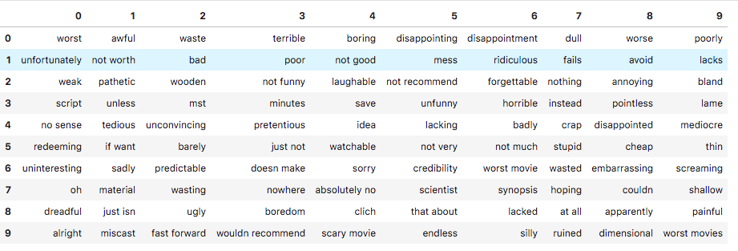
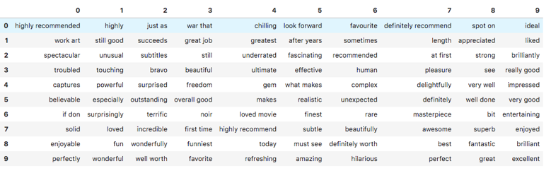

# Sentiment-Analysis

This Project was developed as a part of STAT 542 Practical Statistical Learning at University of Illinois, Urbana-Champaign.

We have been provided with the Movie review dataset which contains the review of a user and a binary target variable which records the sentiment of that review.
We are then asked to build a model that learns to classify the reviews into one of the 2 classes. The kind of problem is a Supervised Classification Problem.

## Following are the steps that I followed:

•	We start by reading in the entire data.tsv and the splits.csv and use the variable s as a nob to select which split id needs to be chosen such that using those id we create our train and test data.

•	Since the review contained some html tags and unwanted text we wanted to perform data cleaning first for which we use Beautiful Soup and then performed tokenisation after which we turned every text to lowercase and  filtered out the stop words(highly frequent words). We then concatenate the remaining tokens into a sentence and return back.

•	We tried approaches to performing stemming , lemmatisation , text normalisation , creating additional features like no of tokens, no of stop words, average length but none of them helped us in improving the score on validation data.

•	Next was the turn of vectorising all the data that we had since we have text in the input and in order for a ML model to learn the separation boundary all the features have to be converted to numeric form, for which we used count and tf-idf scheme. After trying out with multiple ngram models , I finalised by using 2 gram models and setting the min_df=0.001, max_df=0.55.

•	Doing this gave us a vocabulary of size 26k which was too large to work with since we also wanted to have a model whose results can be generalisable and interpretable , hence I decided to use some statistical test(f_classif) to select a subset of features.

•	Using Sklearn SelectKBest and f_classif as the algorithm I filtered out top 2980 words , which would then be used as the vocabulary in all the models. This vocabulary was saved in a text file and loaded when the script is executed.

•	The f_classif computes the ANOVA score for all the features that we have and based on the scores we select the top 2980 values. These 2980 vocab terms contain both positive and negative terms that maximise the separation between 2 classes. I have added a snapshot of the selected vocab below.

•	Once we had our design matrix ready with 25000 observation and 2980 features we decided to use Logistic Regression to perform classification . We use Cross Validation Logistic Regression to find out best hyperparameters for our model.

•	Once we found suitable parameters , we then generate predictions for the test data and save that as mysubmission.txt file along the with test id.

•	We tried out with tree based algorithm, neural networks , SGD classifier , Naïve Bayes with Multinomial distribution but the best score was achieved with the Logistic regression model. 

•	There were 2 advantages to use LR one was that we got the probability of an output belonging to class 1 and second was we had access to model coefficients which helped us understand how the model used the features of the design matrix. There were some negative coefficients and some positive ones .

•	We filtered out these features into positive terms and negative terms based on the coefficients value and analysed them. It was clearly visible that the negative list had words that were associated with negative sentiment and positive had words that were associated with positive sentiment .

### 
 Negative Terms in our Vocabulary of 2980 items 

### 
 Positive Terms in our Vocabulary of 2980 items 

•	The logistic regression used a linear decision boundary to classify the observation into one of the 2 classes. Since we are dealing with Multiple Logistic regression the interpretability of the coefficients could be hard since the variable could be corelated. But still we found that coefficient value was by and large expressive about the way a term was used in a model and as shown above the positive and negative terms really stood out.

•	The tuning parameter in our model was the value of C which is inverse of regularisation strength. Since we had already filtered down our feature set I used LR with ridge regularisation(L2) as L1 would further force some of the features to be zero.

•	The limitation of the model is that we used a linear decision boundary , it could have happen that a nonlinear decision boundary could have helped better. Also we use simple words as features and don’t make use of the latent structure that is the order of words which is not a very good thing to do .Simple Bag of Word model does not exploit this property and hence a RNN or CNN would be required to take the spatial information into account.

•	The model seems to make a wrong prediction in cases where the frequency of terms that we have in the vocabulary is very less or the information is conveyed by not using strong positive or negative words. There are people who express their opinion by elaborating the information and don’t directly say out whether they liked or disliked . The model is not capable of capturing such intents.

•	Since we didn’t use stemming , lemmatisation we see some redundant terms in our vocabulary which could be further trimmed out.

•	In future we could try exploiting a RNN, LSTM network that could really help take the spatial structure and use embedding matrix that will identify similarity between similar terms.

## Results:

Evaluation metric that we used was AUC

* Split1 :0.96375

* Split2 :0.96135

* Split3 :0.96417

## Run Time:

Script executed successfully in 2.48 minutes.

## How to run the model:

In order to run the script just place the data.tsv , splits.csv and myVocab.txt file in a directory and execute the mymain.py script.

## Dataset:

The dataset comes from the Kaggle competition https://www.kaggle.com/c/word2vec-nlp-tutorial/data.
